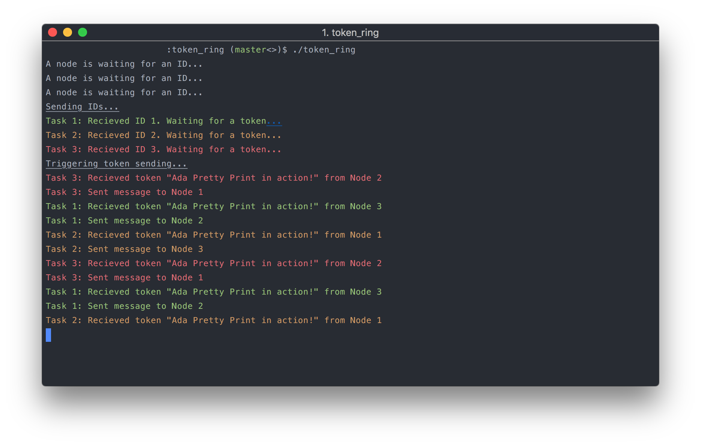

# Ada Pretty Print

This is a package to make printing styled text (in the Terminal) *really* easy.

This package aims to make debugging multiple tasks a bit easier. Rather than examining lines of blank text, make each
task print in a different color!



**Uses ANSI escape sequences, so won't work on every terminal (Especially Windows).**

## Installation

### Requirements

- Ada 95 and up

`$ git clone https://github.com/harrisonturton/ada-pretty-print.git`

You'll need to move the files within `ada-pretty-print` into your project directory to be able to access
them. See your `.gpr` files for more info on what's in your namespace.

## Usage

**Overview**
```ada
Put_Green("This is green");
Put_Red("This is red");

Put_Bold("This is bold");
Put_Underline("This is underlined");
Put_Effect((Bold, Underline), "This is bold & underlined");

Put_Style(Green, (Bold, Underline), "This is green, bold & underlined");
Put_Line("My name is " & Magenta("Patrick")); -- Nested colors, printed using Ada.Text_IO;
```

**Importing**

Importing the package is hardest part. Since we want each task to have a different color, we need to
tell `Pretty_Print` *how many tasks we have*.

```ada
with Pretty_Print;

procedure Main is
  package Task_Print is new Pretty_Print (5); -- Number of tasks we have. Can be 0!
  use Task_Print;
begin
  Put_Style(Green, (Bold, Underline), "Hello World!");
end;
```

**Colors**
```ada
My_Line : String := Green("Hello!"); -- Make the string green
Put_Line(My_Line); -- Print using the standard Ada.Text_IO package

Put_Green("Hello!"); -- Do it all at once!
Put_Color(Red, "This text is red."); -- Specify colors
Put_Line("Hello, my name is " & With_Color(Magenta, "Patrick")); -- Nest colors within normal text
```

**Styles**
```ada
A : String := Bold("Big bold text.");
B : String := With_Effect(Underline, "Underlined text."); -- Specify single effects
C : String := With_Effect((Bold, Underline), "Bold & Underlined!"); -- Specify multiple overlayed effects
Put_Line(A);
Put_Line(B);

Put_Effect((Bold, Italic), "Bold & Italic"); -- Print them all at once
```

**Combined Colors & Effects**
```ada
A : String := With_Style(Green, (Bold, Underline), "Fancy text!");
Put_Line(A);
Put_Style(Green, Bold, "Almost as fancy.");
```

**Different colored Tasks**
```ada
package Task_Print is new Pretty_Print (5); -- Number of tasks we have. Can be 0!
use Task_Print;
...
Put_Task(1, "Recieved ID."); -- Prints "Task 1: Recieved ID." in some color
Put_Task(2, "In rendezvous"); -- Prints "Task 2: In rendezvous" in a different color
```

## Docs
Check out [pretty_print.ads](pretty_print.ads) -- Ada is a self-documenting language!

## Contributing
Make an issue if you find any problems -- I'll try to fix them asap. Pull requests welcome.
